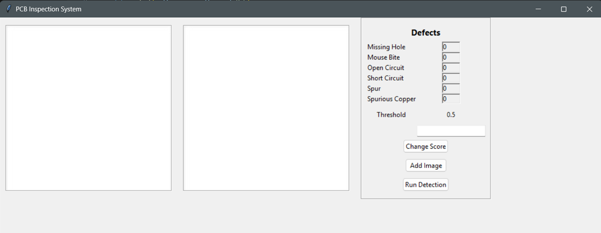
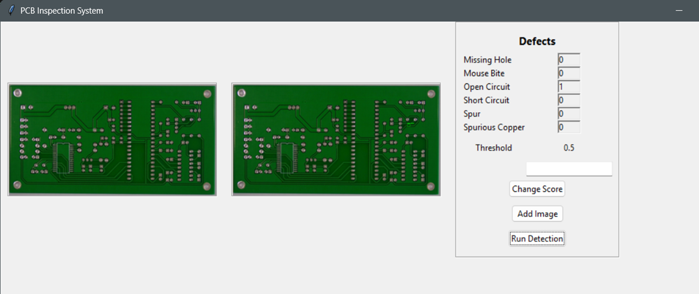
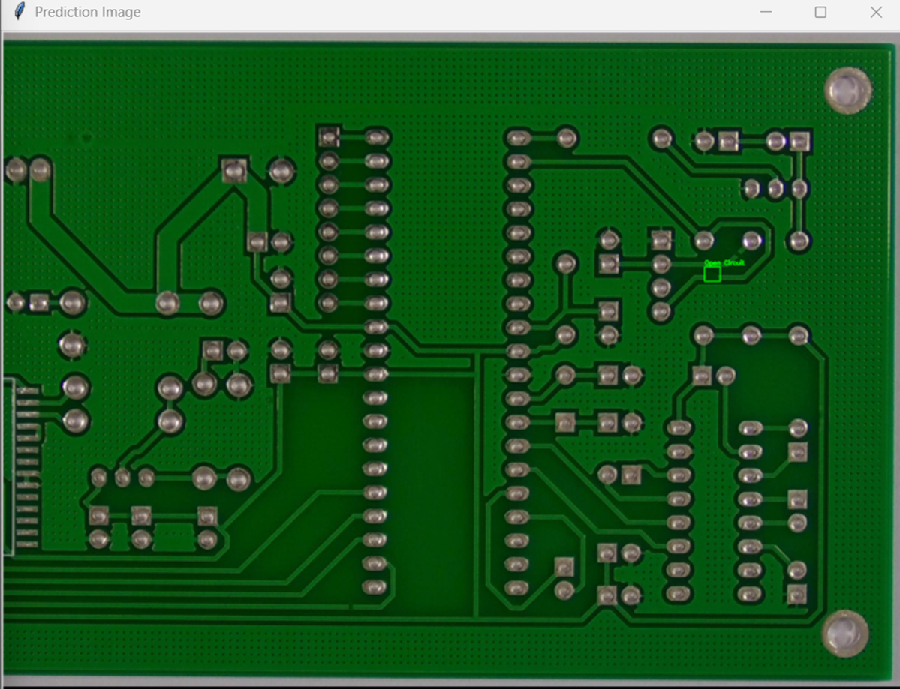

# PCB Surface Defect Detection using YOLOv8

## Overview
- Printed Circuit Boards (PCBs) are the backbone of modern electronic devices. Even minor surface defects in PCBs can lead to malfunction, reduced performance, or complete system failure. Traditional PCB inspection techniques rely on manual inspection or rule-based machine vision systems, which are time-consuming, error-prone, and unsuitable for high-speed manufacturing environments.
- This project implements an **automated PCB surface defect detection system** using **YOLOv8**, a deep learning–based object detection model. The trained model is integrated into a **desktop application** that enables users to load PCB images, detect defects in real time, visualize defect locations using bounding boxes, count detected defects, and inspect results using zoom and pan functionality.

## Defects Detected
- The system is trained to detect the following six PCB surface defects:
1. Missing Hole  
2. Mouse Bite  
3. Open Circuit  
4. Short Circuit  
5. Spur  
6. Spurious Copper  
- Multiple defect types can be detected simultaneously within a single PCB image.

## Model and Framework
- **Model**: YOLOv8 (You Only Look Once – Version 8)
- **Framework**: Ultralytics YOLOv8
- **Deep Learning Backend**: PyTorch
- YOLOv8 is selected due to its real-time performance, high accuracy, efficient deployment, and clean Python API, making it suitable for industrial inspection tasks.

## Dataset and Training

- **Dataset Source**: Roboflow PCB Defect Dataset
- **Total Images**: ~693 annotated PCB images
- **Annotation Type**: Bounding boxes with defect labels
- **Training Environment**: Google Colab (GPU / TPU)

---  

## Trained Model Output (`best.pt`) (optional- below is the reason)
- After training the YOLOv8 model in Google Colab, a trained weight file named `best.pt` is generated.

### How to Locate `best.pt` in Google Colab

1. After training completes, open the **Files (folder)** panel on the left side of Colab.
2. Navigate to: runs/detect/train/weights/
3. Inside this folder, the trained model file `best.pt` will be available.

## Important Note About Training

- Training the model in Google Colab is **optional** and included mainly for **educational purposes**.
- This repository already includes a **pre-trained `best.pt` file** that works out of the box.
- Users can directly run the application without retraining the model.

## What is `best.pt`?
- The `best.pt` file is the trained YOLOv8 model containing learned features of PCB defects. It enables the system to perform defect detection, classification, and localization without requiring retraining.
In simple terms, `best.pt` acts as the intelligence of the system.

## Why Google Colab is Used for Training
- Training deep learning models locally requires high-end GPU hardware. Google Colab is preferred because:
- Provides free GPU and TPU access
- Significantly faster training than CPU systems
- No local hardware dependency
- Easy environment setup
- Integrated Gemini AI assistant for debugging and error resolution
- For academic and learning purposes, Google Colab is the most efficient training platform.

---

## Application Features

- Desktop application built using Tkinter
- Supports PCB images of any resolution
- Real-time defect detection
- Bounding box visualization with defect labels
- Automatic defect count per class
- Adjustable confidence threshold
- Click-to-open large inspection window
- Zoom and pan functionality for detailed inspection
- Supports multiple defects per image

## Project Directory Structure
- PCB-Defect-Detection-YOLOv8/
- ├── app/
- │ ├── main.py # Desktop application (UI logic)
- │ ├── detector.py # YOLOv8 inference and defect processing
- │ └── evaluate.py # Optional evaluation script
- │
- ├── models/
- │ └── best.pt # Trained YOLOv8 model
- │
- ├── assets/
- │ └── whitebg.jpg # UI placeholder image
- │
- ├── test_data/
- │ └── sample_images.jpg # test images
- │
- ├── requirements.txt # Python dependencies
- ├── README.md # Documentation
- └── .venv/ # Virtual environment (optional)

## System Requirements
### Software
- Python 3.9 or later
- Windows / Linux / macOS

### Libraries Used
- ultralytics
- opencv-python
- pillow
- numpy
- tkinter (bundled with Python)

## Installation and Setup

### Step 1: Install `uv`
pip install uv
### Step 2: Create a Virtual Environment
uv venv .venv
### Step 3: Activate the Virtual Environment
- Windows:
.venv\Scripts\activate
- Linux / macOS:
source .venv/bin/activate
### Step 4: Install Required Dependencies
uv pip install -r requirements.txt

## Running the Application
- Ensure the best.pt file is present inside the models/ directory.
- Run the application using:
python app/main.py

## How to Use the Application

- Click Add Image to select a PCB image.
- The original image is displayed in the interface.
- Click Run Detection to detect defects.
- The predicted image with bounding boxes appears.
- Defect counts are displayed automatically.
- Click on any image to open a zoomable inspection window.
- Use mouse scroll to zoom and drag to pan.

## Model Evaluation Metrics
- The model is evaluated using standard object detection metrics:
- Precision (P): 0.904
- Recall (R): 0.797
- mAP@0.5: 0.871
- mAP@0.5–0.95: 0.451
- These metrics are generated during training and validation in Google Colab.

## Technologies Used
- YOLOv8: 	Object detection
- PyTorch:	Deep learning backend
- OpenCV:	Bounding box visualization
- Pillow:	Image handling in UI
- Tkinter:	Desktop application
- Google Colab:	Model training

## Advantages of the Proposed System
- Fully automated PCB inspection
- Faster and more reliable than manual inspection
- Reduced human error
- Real-time detection
- Supports multiple defects per image
- Scalable and deployable
- Suitable for academic and industrial use

## Future Enhancements
- Live camera integration
- Larger and more diverse datasets
- Improved localization accuracy
- Web-based deployment
- Integration with manufacturing pipelines

## Output image
### Intial image
- 
### After uploading the images
- 
### Zoom and see
- 

### I've also provides a ppt too.
- It's a basic ppt, which you can use for explanations. 